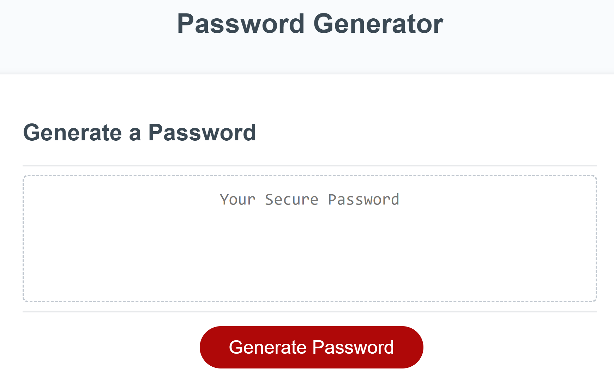
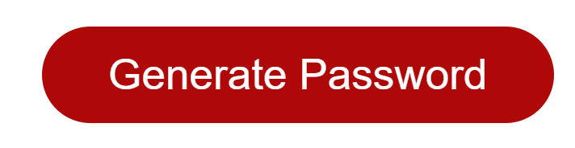
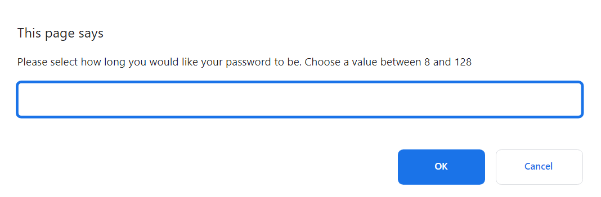
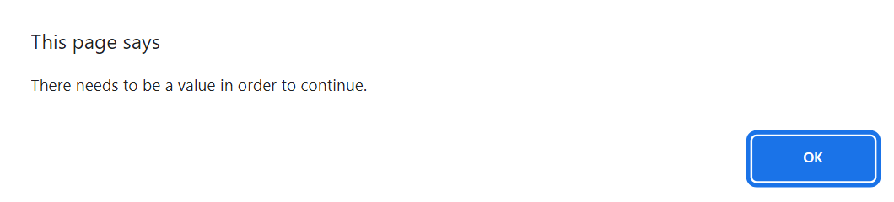
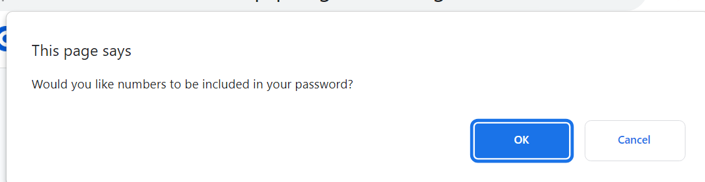
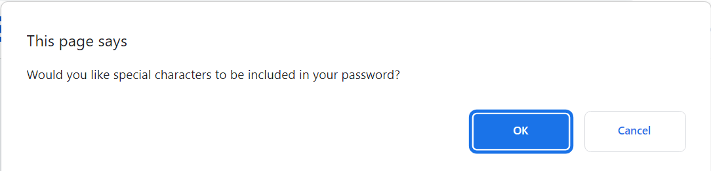
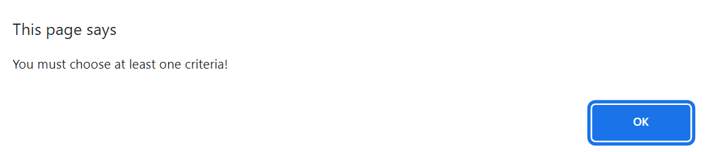
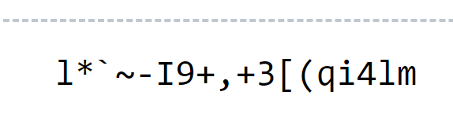

# passgen-challenge-3
Password Generator Challenge 3

## Description

Created the JavaScript for the Password Generator.  By doing so, followed the list of requirements listed below in the Acceptance Criteria.

## Acceptance Criteria

```
GIVEN I need a new, secure password
WHEN I click the button to generate a password
THEN I am presented with a series of prompts for password criteria
WHEN prompted for password criteria
THEN I select which criteria to include in the password
WHEN prompted for the length of the password
THEN I choose a length of at least 8 characters and no more than 128 characters
WHEN asked for character types to include in the password
THEN I confirm whether or not to include lowercase, uppercase, numeric, and/or special characters
WHEN I answer each prompt
THEN my input should be validated and at least one character type should be selected
WHEN all prompts are answered
THEN a password is generated that matches the selected criteria
WHEN the password is generated
THEN the password is either displayed in an alert or written to the page
```

## Installation

N/A

## Usage

When opening the Password Generator, you will see a dialog box with a red button below saying, "Generate Password".  


Once you click on the button...


The following screen will present asking you to enter a number value from 8 to 128...


If nothing is entered, you will see the following...


As long as a value is entered, the following prompts will present and by selecting "OK", that will agree to have the item added.  By selecting "Cancel", the item will be excluded from your password criteria.




If you select "Cancel" on all of the criteria prompts, you will see the following image...


As long as you selected something, you will see a password populate in the dialog box on the main screen.  Below is an example of a password 18 characters long and selecting all options from the prompts...


If you decided you want to try another password option, you can just click on "Generate Password" again and the prompts will start over.

## Credits

N/A

## License

https://choosealicense.com/licenses/mit/